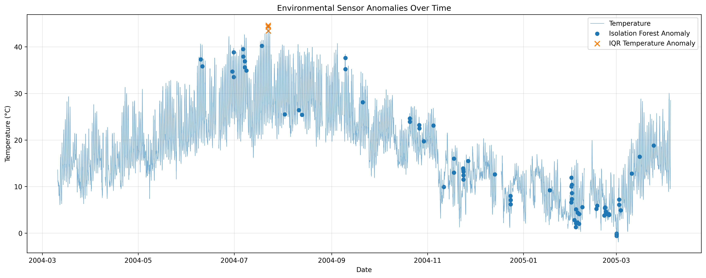
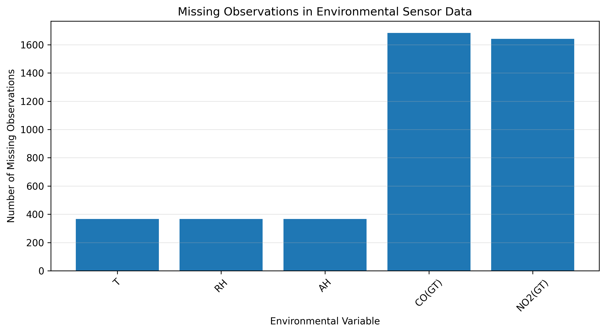

# Environmental Sensor Monitoring & Anomaly Detection

## Overview

This project analyzes real-world environmental sensor data to identify unusual environmental conditions and potential sensor anomalies.

Using the UCI Air Quality dataset, the project combines statistical outlier detection with machine learning-based anomaly detection. Environmental variables including temperature, relative humidity, absolute humidity, carbon monoxide (CO), and nitrogen dioxide (NO₂) are analyzed to identify observations that differ from typical environmental patterns.

The project demonstrates a practical workflow for environmental data science, including data cleaning, missing-data analysis, exploratory visualization, statistical anomaly detection, multivariate machine learning, and interpretation of environmental sensor observations.

## Objectives

- Clean and preprocess environmental sensor data.
- Handle missing and invalid sensor observations.
- Analyze environmental variables over time.
- Detect extreme temperature observations using the Interquartile Range (IQR) method.
- Detect multivariate anomalies using Isolation Forest.
- Compare normal and anomalous environmental conditions.
- Visualize detected anomalies and data-quality patterns.

## Dataset

Dataset: UCI Air Quality Dataset

The dataset contains approximately one year of hourly environmental sensor observations collected in an urban area.

Selected variables used in this project include:

- Temperature (T)
- Relative Humidity (RH)
- Absolute Humidity (AH)
- Carbon Monoxide (CO)
- Nitrogen Dioxide (NO2)

## Skills & Technologies

- **Programming:** Python
- **Data Analysis:** Pandas, NumPy
- **Data Visualization:** Matplotlib
- **Machine Learning:** Scikit-learn, Isolation Forest
- **Environmental Data Science:** Environmental sensor data analysis, anomaly detection, missing-data analysis
- **Statistical Methods:** IQR-based outlier detection, descriptive statistics
- **Data Processing:** Data cleaning, timestamp processing, missing-value handling
- **Domain:** Climate Change & Environmental Informatics

## Methodology

### 1. Data Preprocessing

The dataset was loaded and cleaned using Pandas.

Key preprocessing steps included:

- Removing empty columns.
- Converting the UCI missing-value indicator (-200) to NaN.
- Combining Date and Time into a Timestamp variable.
- Removing records with invalid timestamps.
- Sorting observations chronologically.

### 2. Temperature Anomaly Detection

The Interquartile Range (IQR) method was applied to temperature observations.

The anomaly boundaries were calculated as:

Lower Bound = Q1 - 1.5 × IQR

Upper Bound = Q3 + 1.5 × IQR

This method identified 3 extreme temperature observations.

### 3. Multivariate Anomaly Detection

Isolation Forest was applied to five environmental variables:

- Temperature
- Relative Humidity
- Absolute Humidity
- CO
- NO2

The selected variables were standardized before applying the model.

The Isolation Forest identified 70 multivariate anomalies among the complete observations used for model training.

## Key Results

| Metric | Result |
|---|---:|
| Total observations | 9,357 |
| Temperature observations | 8,991 |
| Temperature IQR anomalies | 3 |
| Isolation Forest anomalies | 70 |
| Total unique anomalies | 73 |
| Percentage flagged | 0.78% |

The IQR method and Isolation Forest identified different observations, with no overlap between the two methods.

The multivariate anomaly group showed notable differences in CO and NO2 compared with normal observations:

- CO mean: 2.15 → 5.41
- NO2 mean: 112.78 → 221.10

These differences represent associations observed in the dataset and should not be interpreted as evidence of causation.

## Data Quality

The final dataset contains:

- 0 missing timestamps
- 0 duplicate timestamps
- 366 missing temperature observations
- 366 missing relative humidity observations
- 366 missing absolute humidity observations
- 1,683 missing CO observations
- 1,642 missing NO2 observations

Missing values were retained in the final dataset rather than being artificially imputed.

## Visualizations

### 1. Environmental Sensor Anomaly Timeline

### 2. Missing Data Overview

## Limitations

- Isolation Forest is an unsupervised anomaly-detection method and does not establish whether an observation represents a true environmental event.
- The selected contamination parameter affects the number of anomalies detected.
- Missing observations reduce the number of records available for multivariate ML analysis.
- The dataset represents a specific monitoring location and time period, so results should not automatically be generalized to other locations.
- The analysis identifies statistical patterns rather than causal relationships.

## Future Improvements

Potential extensions include:

- Testing additional anomaly-detection algorithms such as Local Outlier Factor and One-Class SVM.
- Incorporating additional pollutant and sensor variables.
- Using time-series models for temporal anomaly detection.
- Building an interactive Streamlit dashboard.
- Adding geospatial environmental datasets.
- Integrating satellite-derived environmental indicators.
- Developing real-time environmental sensor monitoring capabilities.

## Project Skills Demonstrated

This project demonstrates practical skills in:

- Environmental data analysis
- Data cleaning and preprocessing
- Statistical anomaly detection
- Unsupervised machine learning
- Feature standardization
- Exploratory data analysis
- Environmental sensor data interpretation
- Python programming
- Data visualization
